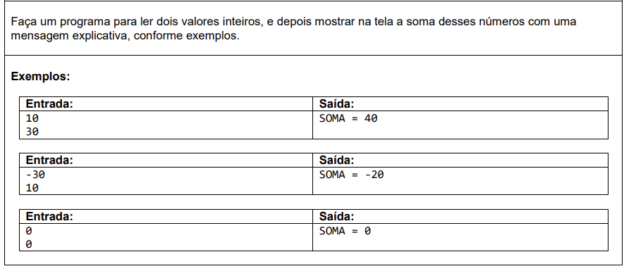
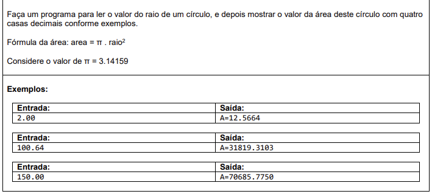
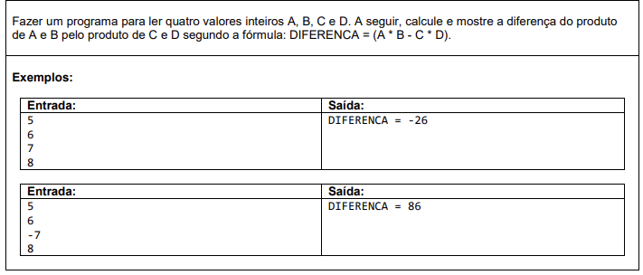
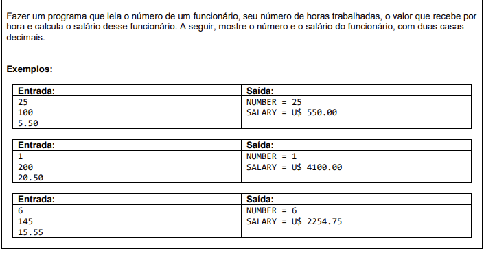
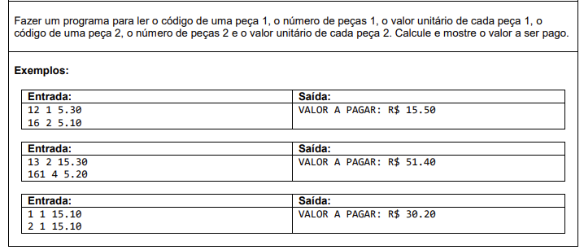

# Exercício C#

Objetivo de treinar lógica e aplicar alguns conceitos da linguagem.

## Exercício 1 ------>

## Exercício 2 ------>

## Exercício 3 ------>

## Exercício 4 ------>

## Exercício 5 ------>

### Minhas soluções estão em: 
**ConsoleApp1** -> **Program.cs**

